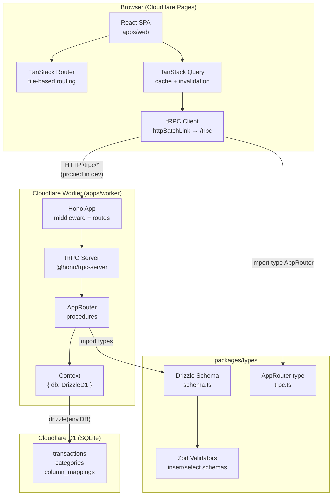
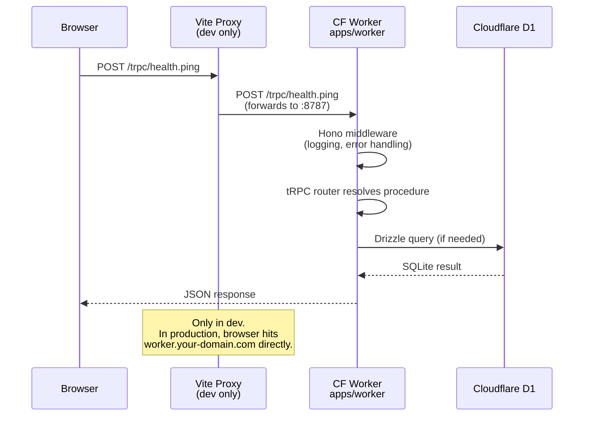
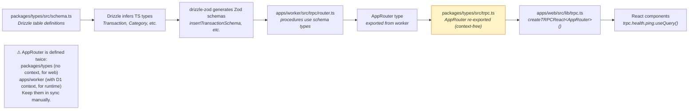
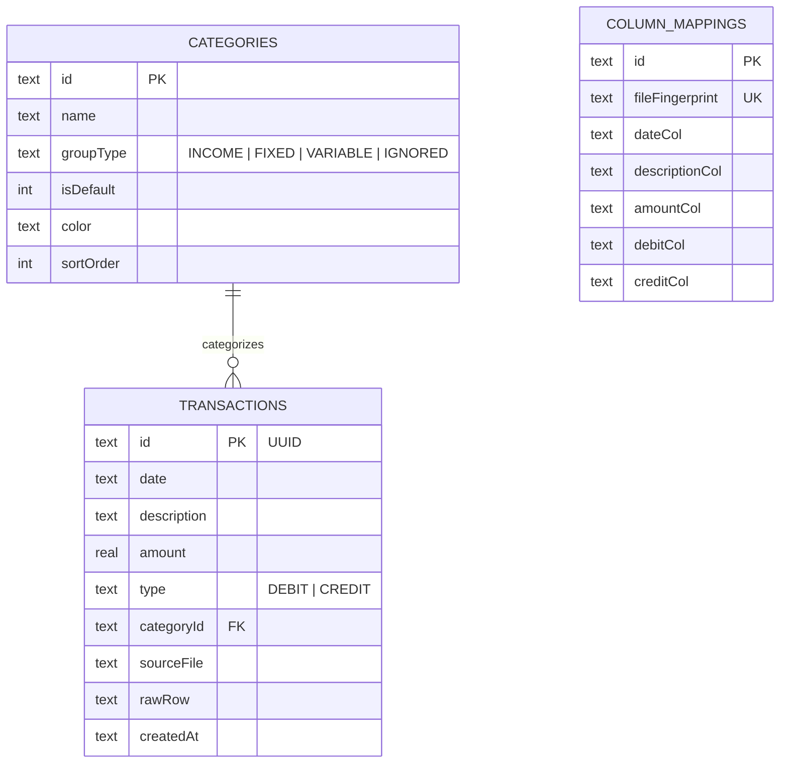

# System Architecture

Personal P&L — technical reference for developers and AI agents.

---

## High-Level Architecture



---

## Request Flow



---

## Type Safety Flow

Types flow in one direction — no codegen, no manual sync.



> **AppRouter sync note**: `packages/types/src/trpc.ts` holds a context-free mirror of the router for the web app's type inference. The authoritative runtime router is `apps/worker/src/trpc/router.ts`. When you add a procedure, update both.

---

## Monorepo Structure

```
personal-pnl/
├── apps/
│   ├── web/                         # React + Vite SPA
│   │   ├── src/
│   │   │   ├── routes/              # TanStack Router file-based routes
│   │   │   │   ├── __root.tsx       # Root layout (Outlet)
│   │   │   │   ├── index.tsx        # / → redirects to /upload
│   │   │   │   ├── upload.tsx       # /upload — CSV ingestion
│   │   │   │   ├── categorize.tsx   # /categorize — transaction tagging
│   │   │   │   └── pnl.tsx          # /pnl — P&L statement view
│   │   │   ├── components/ui/       # shadcn/ui source components
│   │   │   ├── lib/
│   │   │   │   ├── trpc.ts          # createTRPCReact<AppRouter>()
│   │   │   │   ├── query-client.ts  # QueryClient (staleTime: 30s)
│   │   │   │   └── utils.ts         # cn() — clsx + tailwind-merge
│   │   │   ├── routeTree.gen.ts     # Auto-generated by TanStack Router plugin
│   │   │   ├── main.tsx             # App entry: providers + RouterProvider
│   │   │   └── index.css            # Tailwind CSS v4 + shadcn CSS vars
│   │   ├── vite.config.ts           # Proxy /trpc → :8787, @/ alias, plugins
│   │   ├── components.json          # shadcn/ui config
│   │   └── tsconfig.json            # @/* and @pnl/types path aliases
│   │
│   └── worker/                      # Cloudflare Worker — Hono + tRPC
│       ├── src/
│       │   ├── pnl-api.app.ts       # Hono app — middleware, routes, tRPC mount
│       │   ├── context.ts           # Env (D1 binding) + Hono Variables types
│       │   └── trpc/
│       │       ├── router.ts        # appRouter — all tRPC procedures (runtime)
│       │       └── context.ts       # TRPCContext — { db: DrizzleD1 }
│       └── wrangler.jsonc           # Worker config — port 8787, D1 binding
│
└── packages/
    ├── types/                       # @pnl/types — shared across apps
    │   └── src/
    │       ├── schema.ts            # Drizzle tables + Zod insert/select schemas
    │       ├── trpc.ts              # AppRouter type (context-free, for web)
    │       └── index.ts             # Re-exports everything
    ├── hono-helpers/                # Shared Hono middleware (logging, errors, CORS)
    ├── tools/                       # Dev scripts — run-vite-build, run-tsc, etc.
    ├── eslint-config/               # Shared ESLint config
    └── typescript-config/           # Shared tsconfigs (base, workers, lib)
```

---

## Key Configuration Decisions

### Dev proxy (Vite → Worker)

In development, `apps/web/vite.config.ts` proxies all `/trpc/*` requests to the Worker at `localhost:8787`. This avoids CORS issues and mirrors the production setup where the browser calls the same origin.

```ts
// vite.config.ts
server: {
  proxy: {
    '/trpc': { target: 'http://localhost:8787', changeOrigin: true }
  }
}
```

In production (Cloudflare Pages), the tRPC URL is configured to point directly to the deployed Worker URL.

### Path aliases

| Alias | Scope | Resolves to |
|---|---|---|
| `@/*` | `apps/web` only | `apps/web/src/*` |
| `@pnl/types` | `apps/web`, `apps/worker` | `packages/types/src` |

### Database (Cloudflare D1)

D1 is a SQLite database bound directly to the Worker — no network hop, no connection string. The binding is declared in `wrangler.jsonc` and accessed as `env.DB` (type: `D1Database`) inside the Worker. Drizzle wraps it: `drizzle(env.DB, { schema })`.

Migrations are managed by `drizzle-kit` and stored in `packages/types/drizzle/`. Apply with:

```bash
pnpm db:push          # remote D1
```

### shadcn/ui + Tailwind CSS v4

Uses Tailwind CSS v4 (CSS-native, no `tailwind.config.js`). Theme is defined via CSS variables in `src/index.css` using `oklch()` color format. Components are copied into `apps/web/src/components/ui/` and are fully editable.

Add a component:
```bash
cd apps/web && pnpm dlx shadcn@latest add <component>
```

---

## Data Model



---

## Local Dev Commands

```bash
just dev          # Start web (:5173) + worker (:8787) concurrently
just check        # Lint + type-check + format (all packages)
just build        # Build all packages via Turborepo
just deploy       # Deploy worker + web to Cloudflare

pnpm db:push      # Apply Drizzle schema to D1 (remote)

# Targeted
bun turbo -F pnl-web dev       # Web only
bun turbo -F pnl-api dev       # Worker only
pnpm -F @pnl/types db:generate # Regenerate Drizzle migrations
```
